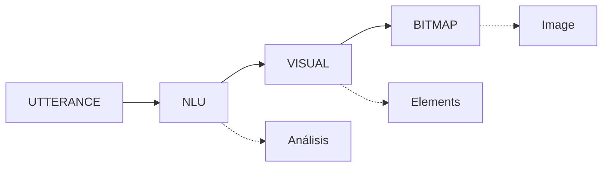

# Instrucciones del Proyecto PICTOS.NET para Claude

Este documento contiene instrucciones específicas para Claude Code al trabajar en este proyecto.

---

## Reglas de Estilo para Documentación Markdown

### Emojis
**NO usar emojis en archivos Markdown (.md) ni mermaid **

- ❌ Evitar completamente el uso de emojis en documentación
- ✓ Usar texto plano para títulos y secciones
- ✓ Usar asteriscos, guiones o números para listas

**Ejemplos:**

```markdown
❌ Incorrecto:
## 🚀 Inicio Rápido
## 📚 Documentación

✓ Correcto:
## Inicio Rápido
## Documentación
```

### Reglas Horizontales
**NO usar reglas horizontales (`---`) en archivos Markdown**

- ❌ Evitar el uso de `---`, `***`, o `___` como separadores
- ✓ Usar espaciado natural entre secciones (líneas en blanco)
- ✓ Usar jerarquía de títulos (##, ###) para estructurar el documento

**Ejemplos:**

```markdown
❌ Incorrecto:
## Sección 1
Contenido...

---

## Sección 2
Contenido...

✓ Correcto:
## Sección 1
Contenido...

## Sección 2
Contenido...
```

### Diagramas y Visualizaciones
**Usar diagramas Mermaid en lugar de ASCII art**

- ❌ Evitar diagramas con caracteres ASCII (└─, ├─, etc.)
- ✓ Usar bloques de código Mermaid para diagramas de flujo, secuencia, arquitectura
- ✓ Mermaid es más legible, escalable y se renderiza correctamente en GitHub/web

**Ejemplos:**

```markdown
❌ Incorrecto (ASCII art):
```
UTTERANCE → NLU → VISUAL → BITMAP
    ↓         ↓       ↓        ↓
Análisis  Frames  Elements  Image
```
```

```markdown
✓ Correcto (Mermaid):

```
```

**Tipos de diagramas Mermaid útiles:**
- `graph` / `flowchart` - Flujos y procesos
- `sequenceDiagram` - Interacciones entre componentes
- `classDiagram` - Estructuras de datos TypeScript
- `stateDiagram` - Estados de la aplicación
- `gitGraph` - Flujos de trabajo Git

---

## Contexto del Proyecto

### Stack Tecnológico
- React 19 + TypeScript 5.8 + Vite 6
- Tailwind CSS 3.4
- Google Gemini APIs (3 Pro, 2.5 Flash, 3 Pro Image)
- VTracer WASM (vectorización)
- IndexedDB + localStorage

### Filosofía de Código
- Evitar over-engineering
- Código simple y directo
- Comentarios solo donde la lógica no es evidente
- Priorizar legibilidad sobre optimización prematura

### Estructura de Documentación
```
/
├── README.md              # Visión general del proyecto
└── docs/
    ├── README.md         # Índice de documentación
    ├── TUTORIAL.md       # Guía de usuario (castellano)
    ├── ARCHITECTURE.md   # Documentación técnica
    ├── CONTRIBUTING.md   # Guía para desarrolladores
    ├── SECURITY.md       # Políticas de seguridad
    └── img/              # Capturas de pantalla y assets
```

---

## Convenciones Específicas del Proyecto

### Idioma
- **Código y commits**: Inglés
- **Documentación de usuario**: Castellano (español latinoamericano)
- **Documentación técnica**: Puede ser bilingüe según contexto

### Commits
- Usar conventional commits: `tipo(scope): mensaje`
- Tipos: `feat`, `fix`, `docs`, `refactor`, `test`, `chore`
- Mensajes en español descriptivos
- Incluir `Co-Authored-By: Claude Sonnet 4.5 <noreply@anthropic.com>`

### Nomenclatura
- Componentes React: PascalCase (`SVGGenerator.tsx`)
- Servicios: camelCase con sufijo Service (`geminiService.ts`)
- Tipos: PascalCase con prefijo de contexto (`RowData`, `NLUData`)
- Hooks: camelCase con prefijo `use` (`useSVGLibrary.ts`)

---

## Esquemas de Investigación (Git Submodules)

El proyecto integra esquemas externos como submodules:
- `schemas/nlu-schema` - Análisis lingüístico NSM
- `schemas/mf-svg-schema` - SVG estructurados

**Importante**: No modificar contenido de submodules directamente.

---

## Seguridad

⚠️ **API Keys expuestas**: Esta aplicación expone intencionalmente la API key de Gemini en el cliente. Consultar `docs/SECURITY.md` antes de trabajar con credenciales.

---

## Notas de Desarrollo

### Pipeline de Generación
1. **COMPRENDER** (NLU): Análisis semántico NSM
2. **COMPONER** (Visual): Elementos jerárquicos + composición espacial
3. **PRODUCIR** (Bitmap): Renderizado de imagen
4. **VECTORIZAR** (opcional): Bitmap → SVG estructurado

### Almacenamiento
- **localStorage**: Configuración global + metadatos de grafos
- **IndexedDB**: Imágenes bitmap (optimización de espacio)
- **Biblioteca SVG**: Almacenamiento independiente (SSoT)

---

*Última actualización: 2026-02-12*
