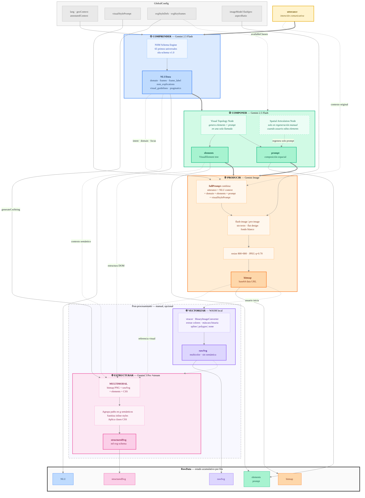
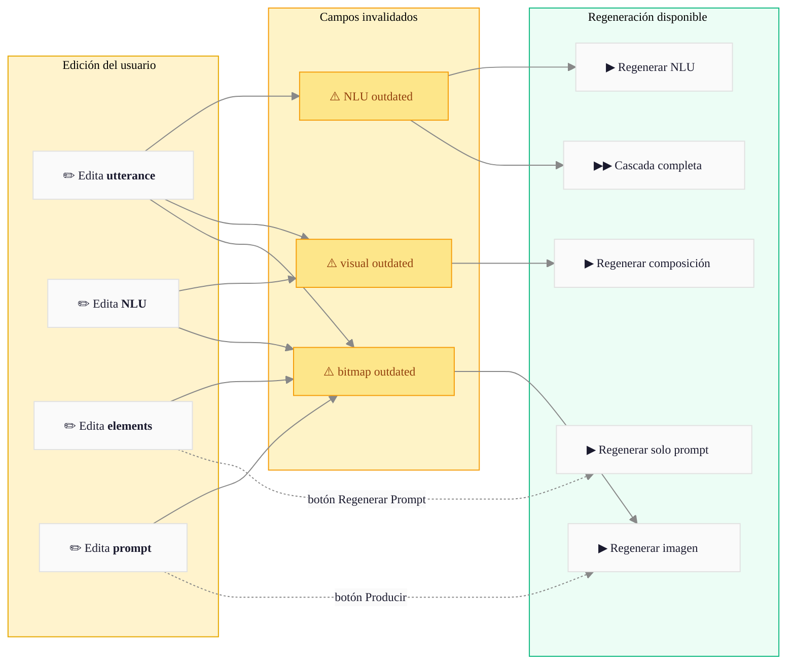

# [PICTOS.NET](https://pictos.net)

**Pictogramas generativos para la Comunicación Aumentativa y Alternativa (CAA)**

* [](https://app.netlify.com/projects/pictos/deploys)
* 


PICTOS.NET transforma intenciones comunicativas expresadas en lenguaje natural en pictogramas mediante un pipeline de razonamiento semántico. Es parte de la investigación doctoral de [Herbert Spencer](https://herbertspencer.net/cc) y de **[MediaFranca](https://github.com/mediafranca)** — una iniciativa de código abierto de bien público para la CAA.


La rama de desarrollo `lab` contiene la siguiente versión:

* ver: [PICTOS-NEXT](pictos-next.netlify.app)
* [](https://app.netlify.com/projects/pictos-next/deploys)

---

## Cómo funciona

El sistema implementa un pipeline de tres fases automáticas más dos de post-procesamiento opcional. Cada fase es visible, editable y regenerable de forma independiente:

**① Comprender** (Gemini 2.5 Flash) — Análisis lingüístico profundo basado en Natural Semantic Metalanguage (NSM): 65 primitivos semánticos universales. Produce un esquema estructurado con intención comunicativa, dominio, roles semánticos (FrameNet) e instrucciones visuales.

**② Componer** (Gemini 2.5 Flash) — Traduce el análisis NLU a una jerarquía de elementos visuales (`elements`) y una descripción de articulación espacial (`prompt`). Si el usuario edita los elementos, puede regenerar solo el prompt sin repetir toda la composición.

**③ Producir** (Gemini Image) — Renderiza el pictograma combinando el contexto semántico, los elementos, el prompt espacial y el estilo visual global. Resultado: bitmap JPEG 800×800.

**④ Vectorizar** (vtracer WASM, local) — Convierte el bitmap a SVG mediante clustering jerarquico de color (ColorImageConverter nativo de visioncortex). Proceso local, sin API. Resultado: SVG crudo sin semantica.

**⑤ Estructurar** (Gemini 3 Pro, multimodal) — Reorganiza los paths del SVG crudo en grupos semánticos según la jerarquía de elementos, embebiendo metadatos de accesibilidad según [mf-svg-schema](https://github.com/mediafranca/mf-svg-schema).

Las fases ④ y ⑤ son opcionales y las inicia el usuario manualmente. La cascada automática (①→②→③) se ejecuta al crear una nueva frase o presionar Play en una fila. Los pictogramas generados pueden evaluarse con el marco [ICAP](https://github.com/mediafranca/ICAP).

## Esquema detallado



### Modelo de retroalimentación

Cada campo es editable. Al modificar un dato, los pasos posteriores se marcan como `outdated` (desactualizado) y el usuario puede regenerarlos selectivamente:




---

## Filosofía

Los pictogramas son más que ilustraciones: son actos comunicativos. PICTOS propone que para generar un buen pictograma hay que primero *comprender profundamente* qué se quiere comunicar, antes de decidir cómo visualizarlo.

El proyecto nace de una convicción: **la comunicación visual debe ser explicable y accesible, basada en el contexto**. 

Los pictogramas generados buscan reducir barreras cognitivas, facilitar la expresión de necesidades básicas y contribuir a la autonomía de personas con diversidad funcional.

---

## Ecosistema MediaFranca

PICTOS.NET es parte de [MediaFranca](https://github.com/mediafranca), un conjunto de esquemas abiertos para la comunicación aumentativa y alternativa:

| Repositorio | Descripción |
|---|---|
| [nlu-schema](https://github.com/mediafranca/nlu-schema) | Esquema de análisis lingüístico profundo basado en NSM |
| [mf-svg-schema](https://github.com/mediafranca/mf-svg-schema) | Estándar para pictogramas SVG semánticos y autocontenidos |
| [ICAP](https://github.com/mediafranca/ICAP) | Marco de evaluación de pictogramas (6 dimensiones cognitivas) |
| [pictos.cl](https://pictos.cl) | Plataforma de apoyos visuales para servicios públicos (Núcleo Accesibilidad PUCV) |

`nlu-schema` y `mf-svg-schema` se incluyen como git submodules en este repositorio, lo que permite versionado explícito y reproducibilidad científica.

---

## Uso

**Aplicación web**: [pictos.net](https://pictos.net)

Los pictogramas y datos se almacenan **localmente en el navegador** (IndexedDB + localStorage). Para respaldar tu trabajo usa **Exportar Librería** — genera un JSON con todas las imágenes y metadatos del pipeline.

Puedes compartir tu grafo exportado con comentarios a [hspencer@ead.cl](mailto:hspencer@ead.cl). Esto ayuda a mejorar el sistema y construir corpus de investigación.

---

## Desarrollo local

```bash
git clone --recurse-submodules https://github.com/hspencer/pictos-net.git
cd pictos-net
cp .env.example .env        # agrega tu GEMINI_API_KEY
npm install
npm run dev                 # → http://localhost:3000
```

Obtén tu API key en [Google AI Studio](https://aistudio.google.com/app/apikey).

Ver [docs/CONTRIBUTING.md](./docs/CONTRIBUTING.md) para instrucciones completas, incluyendo deployment en GitHub Pages.

---

## Stack

- React 19
- TypeScript
- Vite
- Tailwind CSS
- Zustand
- Google Gemini API
- vtracer WASM
- IndexedDB

---

## Documentación

### Arquitectura y desarrollo

| Documento | Descripción |
|---|---|
| [docs/ARCHITECTURE.md](./docs/ARCHITECTURE.md) | Arquitectura técnica, modelos de datos, servicios |
| [docs/PIPELINE.md](./docs/PIPELINE.md) | Pipeline de generación paso a paso |
| [docs/CONTRIBUTING.md](./docs/CONTRIBUTING.md) | Guía de desarrollo, submodules, i18n, deployment |
| [docs/SECURITY.md](./docs/SECURITY.md) | Gestión de API keys, consideraciones de seguridad |
| [docs/PROMPT_MAESTRO.md](./docs/PROMPT_MAESTRO.md) | Prompt principal de Gemini documentado |

### Interfaz de usuario

| Documento | Descripción |
|---|---|
| [docs/UI_MAP.md](./docs/UI_MAP.md) | Mapa estructural de la UI: todos los IDs semánticos |
| [docs/UI_CONVENTIONS.md](./docs/UI_CONVENTIONS.md) | Convenciones de diseño: colores, tipografía, z-index |
| [docs/TUTORIAL.md](./docs/TUTORIAL.md) | Tutorial de uso paso a paso |

---

## Comunidad

PICTOS invita a **lingüistas** a refinar el análisis NLU y NSM, **diseñadores** a mejorar la composición visual, a **educadores y sicólogos** a imaginar nuevos escenarios de uso, **investigadores** a validar métricas de calidad, y **desarrolladores** a extender las funcionalidades.

Las contribuciones son bienvenidas. Reporta bugs, propone features o abre un Pull Request en GitHub.

---

## Citar

```
Spencer, H. (2026). PICTOS.NET: Pictogramas generativos para la accesibilidad cognitiva.
MediaFranca. https://pictos.net
```

---

*Licencia: Apache 2.0 (código) · CC-BY-4.0 (pictogramas generados, según elección del usuario)*

---

## Convención de interfaz

La UI sigue una convención estricta de IDs semánticos documentada en
[docs/UI_MAP.md](./docs/UI_MAP.md). Todo componente de región o sección principal
debe tener un `id` semántico. Antes de modificar cualquier componente de interfaz,
leer [docs/UI_CONVENTIONS.md](./docs/UI_CONVENTIONS.md).
