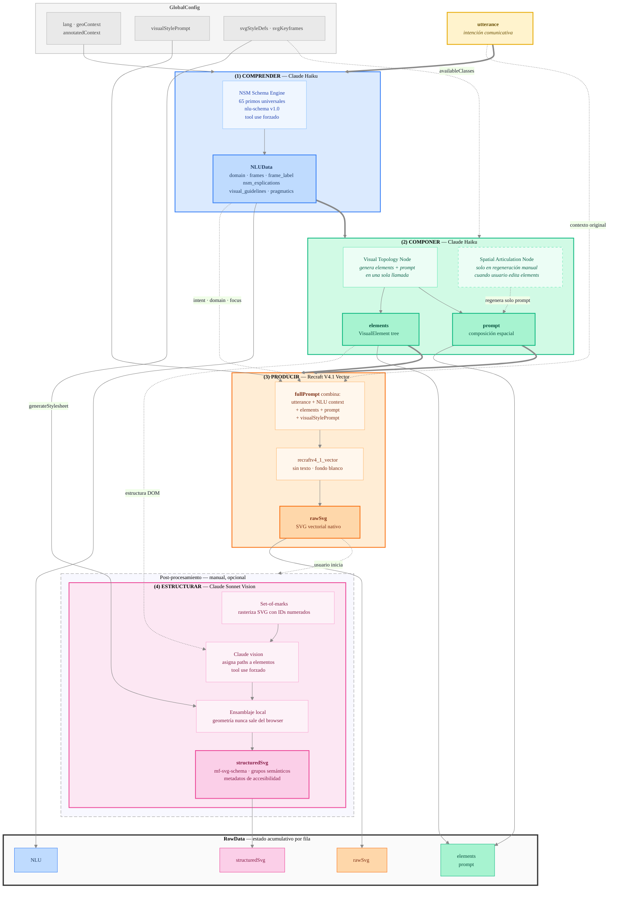
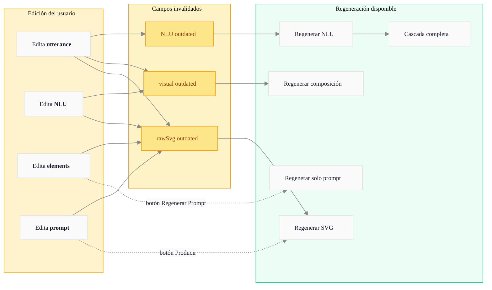

# [PICTOS.NET](https://pictos.net)

**Pictogramas generativos para la Comunicación Aumentativa y Alternativa (CAA)**

* [](https://app.netlify.com/projects/pictos/deploys)
* 
* 

PICTOS.NET transforma intenciones comunicativas expresadas en lenguaje natural en pictogramas mediante un pipeline de razonamiento semántico. Es parte de la investigación doctoral de [Herbert Spencer](https://herbertspencer.net/cc) y de **[MediaFranca](https://github.com/mediafranca)** — una iniciativa de código abierto de bien público para la CAA.

La rama de desarrollo `dev` contiene la siguiente versión:

* ver: [next.PICTOS.net](https://next.pictos.net)
* [](https://app.netlify.com/projects/pictos-next/deploys)

## Cómo funciona

El sistema implementa un pipeline de tres fases automáticas más una de post-procesamiento opcional. Cada fase es visible, editable y regenerable de forma independiente:

**(1) Comprender** (Claude Haiku) — Análisis lingüístico profundo basado en Natural Semantic Metalanguage (NSM): 65 primitivos semánticos universales. Usa tool use forzado para garantizar JSON válido. Produce un esquema estructurado con intención comunicativa, dominio, roles semánticos (FrameNet) e instrucciones visuales.

**(2) Componer** (Claude Haiku) — Traduce el análisis NLU a una jerarquía de elementos visuales (`elements`) y una descripción de articulación espacial (`prompt`). Si el usuario edita los elementos, puede regenerar solo el prompt sin repetir toda la composición.

**(3) Producir** (Recraft V4.1 Vector) — Genera el pictograma como SVG nativo a partir del contexto semántico, los elementos, el prompt espacial y el estilo visual configurado. No hay bitmap intermedio: el resultado es un SVG vectorial directamente editable.

**(4) Estructurar** (Claude Sonnet, opcional) — Reorganiza los paths del SVG crudo en grupos semánticos según la jerarquía de elementos de la fase 2, embebiendo metadatos de accesibilidad según [mf-svg-schema](https://github.com/mediafranca/mf-svg-schema). Usa visión por computadora (set-of-marks) + ensamblaje local: la geometría nunca sale del navegador.

La cascada automática (1 → 2 → 3) se ejecuta al crear una nueva frase o presionar Play. La fase 4 es opcional y la inicia el usuario manualmente. Los pictogramas pueden evaluarse con el marco [ICAP](https://github.com/mediafranca/ICAP).

## Esquema detallado



### Modelo de retroalimentación

Cada campo es editable. Al modificar un dato, los pasos posteriores se marcan como `outdated` y el usuario puede regenerarlos selectivamente:



### Parámetros de configuración global

| Parámetro | Fase | Estado | Descripción |
|---|---|---|---|
| `lang` | 1, 2, 4 | Activo | Idioma del análisis NLU y de los IDs de elementos |
| `uiLang` | — | Activo | Idioma de la interfaz (independiente del NLU) |
| `geoContext` | 1, 4 | Activo | Región geográfica para contextualización y metadatos a11y |
| `annotatedContext` | 1 | Activo | Contexto adicional anotado por el usuario (inyectado en el prompt NLU) |
| `visualStylePrompt` | 3 | Activo | Descripción de estilo visual inyectada en el prompt de Recraft |
| `svgStyleDefs` | 2, 4 | Activo | Definiciones CSS del SVG (clases disponibles en composición y en estructuración) |
| `svgKeyframes` | 4 | Activo | Keyframes de animación para el SVG estructurado |
| `aspectRatio` | — | Inactivo | Era el aspect ratio de Gemini Image; Recraft V4.1 usa tamaño fijo |
| `imageModel` | — | Inactivo | Era el selector flash/pro de Gemini; eliminado del pipeline |

---

## Filosofía

Los pictogramas son más que ilustraciones: son actos comunicativos. PICTOS propone que para generar un buen pictograma hay que primero *comprender profundamente* qué se quiere comunicar, antes de decidir cómo visualizarlo.

El proyecto nace de una convicción: **la comunicación visual debe ser explicable y accesible, basada en el contexto**.

Los pictogramas generados buscan reducir barreras cognitivas, facilitar la expresión de necesidades básicas y contribuir a la autonomía de personas con diversidad funcional.

---

## Ecosistema MediaFranca

PICTOS.NET es parte de [MediaFranca](https://github.com/mediafranca), un conjunto de esquemas abiertos para la comunicación aumentativa y alternativa:

| Repositorio | Descripción |
|---|---|
| [nlu-schema](https://github.com/mediafranca/nlu-schema) | Esquema de análisis lingüístico profundo basado en NSM |
| [mf-svg-schema](https://github.com/mediafranca/mf-svg-schema) | Estándar para pictogramas SVG semánticos y autocontenidos |
| [ICAP](https://github.com/mediafranca/ICAP) | Marco de evaluación de pictogramas (6 dimensiones cognitivas) |
| [pictos.cl](https://pictos.cl) | Plataforma de apoyos visuales para servicios públicos (Núcleo Accesibilidad PUCV) |

`nlu-schema` y `mf-svg-schema` se incluyen como git submodules en este repositorio.

---

## Uso

**Aplicación web**: [pictos.net](https://pictos.net)

Los pictogramas y datos se almacenan **localmente en el navegador** (IndexedDB + localStorage). Para respaldar tu trabajo usa **Exportar Librería** — genera un JSON con todas las imágenes y metadatos del pipeline.

Puedes compartir tu grafo exportado con comentarios a [contact@pictos.net](mailto:contact@pictos.net).

---

## Desarrollo local

```bash
git clone --recurse-submodules https://github.com/hspencer/pictos-net.git
cd pictos-net
cp .env.example .env        # agrega ANTHROPIC_API_KEY y RECRAFT_API_KEY
npm install
npm run dev                 # → http://localhost:9001 (netlify dev)
```

Las API keys necesarias:
- `ANTHROPIC_API_KEY` — [console.anthropic.com](https://console.anthropic.com)
- `RECRAFT_API_KEY` — [recraft.ai](https://www.recraft.ai/api)
- `GITHUB_TOKEN` — para la función de compartir pictogramas (opcional)

Ver [docs/CONTRIBUTING.md](./docs/CONTRIBUTING.md) para instrucciones completas.

---

## Stack

- React 19 + TypeScript 5.8
- Vite 6 + Tailwind CSS 3.4
- Zustand (estado SVG editor)
- Anthropic SDK — Claude Haiku 4.5 (fases 1 y 2) + Claude Sonnet 4.6 (fase 4, visión)
- Recraft V4.1 Vector (fase 3, SVG nativo)
- Netlify Functions (proxy API con JWT) + Netlify Identity
- IndexedDB v3 + localStorage (persistencia dual)

---

## Documentación

### Arquitectura y desarrollo

| Documento | Descripción |
|---|---|
| [docs/ARCHITECTURE.md](./docs/ARCHITECTURE.md) | Arquitectura técnica, modelos de datos, servicios |
| [docs/CONTRIBUTING.md](./docs/CONTRIBUTING.md) | Guía de desarrollo, submodules, i18n, deployment |
| [docs/SECURITY.md](./docs/SECURITY.md) | Gestión de API keys, consideraciones de seguridad |
| [docs/PIPELINE_MIGRATION_CLAUDE_RECRAFT.md](./docs/PIPELINE_MIGRATION_CLAUDE_RECRAFT.md) | Notas de la migración Gemini → Claude + Recraft (v1.x → v2.0) |

### Interfaz de usuario

| Documento | Descripción |
|---|---|
| [docs/UI_MAP.md](./docs/UI_MAP.md) | Mapa estructural de la UI: todos los IDs semánticos |
| [docs/UI_CONVENTIONS.md](./docs/UI_CONVENTIONS.md) | Convenciones de diseño: colores, tipografía, z-index |
| [docs/CSS_STYLING_ARCHITECTURE.md](./docs/CSS_STYLING_ARCHITECTURE.md) | Modelo de dos niveles para estilos SVG (clases + overrides locales) |
| [docs/WCAG_ROADMAP.md](./docs/WCAG_ROADMAP.md) | Estado de conformidad WCAG 2.1 AA y roadmap de accesibilidad |

---

## Comunidad

PICTOS invita a **lingüistas** a refinar el análisis NLU y NSM, **diseñadores** a mejorar la composición visual, a **educadores y sicólogos** a imaginar nuevos escenarios de uso, **investigadores** a validar métricas de calidad, y **desarrolladores** a extender las funcionalidades.

Las contribuciones son bienvenidas. Reporta bugs, propone features o abre un Pull Request en GitHub.

---

## Citar

```
Spencer, H. (2026). PICTOS.NET: Pictogramas generativos para la accesibilidad cognitiva.
MediaFranca. https://pictos.net
```

*Licencia: Apache 2.0 (código) · CC-BY-4.0 (pictogramas generados, según elección del usuario)*
