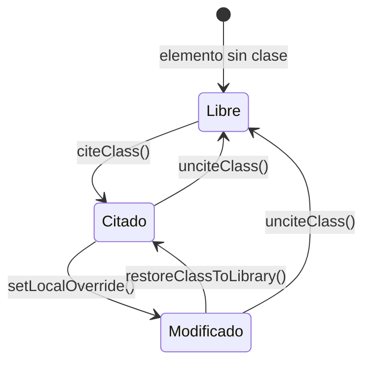
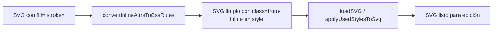

# CSS Styling Architecture — SVG Editor

Documento técnico que describe el modelo de dos niveles para la gestión de estilos en el Editor SVG.

Última actualización: 2026-03-02

## Regla central

**Cero atributos de presentación inline.** Ningún elemento SVG puede llevar `fill`, `stroke`, `stroke-width`, `opacity` ni `style` como atributos del elemento. Todo estilo vive en el bloque `<style>` del propio SVG.

## Los dos niveles

El bloque `<style>` tiene dos secciones ordenadas:

```xml
<style>
  /* Nivel 1 — Reglas de biblioteca (generadas automáticamente) */
  .main { fill: #1a1a1a; stroke: #ffffff; stroke-width: 3pt; }
  .red  { fill: #FF3B30; stroke: #CC2D25; }

  /* --- local overrides --- */

  /* Nivel 2 — Overrides locales por elemento (editados por el usuario) */
  #el-abc123.red  { fill: #FF6600; }
  #cabeza.main    { stroke: none; }
</style>
```

### Nivel 1: Reglas de biblioteca

- Selector de clase pura: `.nombre-clase { ... }`
- Generadas por `applyUsedStylesToSvg()` en `stores/svgEditorStore.ts`
- Solo incluyen las clases realmente usadas en el documento (garbage collection automático)
- No se editan directamente; se gestionan a través de la acción `citeClass` / `unciteClass`

### Nivel 2: Overrides locales

- Selector compuesto: `#element-id.nombre-clase { ... }`
- Especificidad `(1,1,0)` — siempre supera al nivel 1 `(0,1,0)` sin necesidad de `!important`
- Escritos por `setOverrideRule()` en `utils/styleUtils.ts`
- Leídos y parseados por `parseOverrideRules()` en `utils/styleUtils.ts`

## Ciclo de vida completo



### CITAR (`citeClass`)

1. Agrega `className` al atributo `class` del elemento
2. Llama a `applyUsedStylesToSvg()` — la clase aparece en el bloque `<style>` nivel 1
3. Elimina cualquier atributo inline residual del elemento
4. Sincroniza `overrideMap` en el store

### INSTANCIAR

Ocurre automáticamente dentro de `applyUsedStylesToSvg()`. Si la clase ya existe en la biblioteca (`styleDefinitions`), su regla CSS se copia al `<style>` del SVG. Si la clase no está en la biblioteca, no se instancia (el selector queda vacío o ausente).

### MODIFICAR (`setLocalOverride`)

1. Llama a `setOverrideRule(svgDocument, elementId, className, declarations)` en `styleUtils.ts`
2. Parsea el `<style>` actual con `parseOverrideRules()`
3. Fusiona las declaraciones en el mapa de overrides
4. Reconstruye el `<style>` con `rebuildStyleBlock()`: nivel 1 intacto + nivel 2 actualizado
5. Sincroniza `overrideMap` en el store

### DESCITAR (`unciteClass`)

1. Elimina `className` del atributo `class` del elemento
2. Llama a `removeOverrideRule()` — borra el override `#id.class` si existe
3. Llama a `applyUsedStylesToSvg()` — si ningún elemento usa ya la clase, su regla de nivel 1 desaparece (garbage collection)
4. Sincroniza `overrideMap` en el store

### RECOLECTAR (Garbage Collection)

Se ejecuta automáticamente en cada llamada a `applyUsedStylesToSvg()`:

1. `getUsedClassNamesFromSvg()` — escanea todos los atributos `class` del documento
2. `getUsedStyles()` — filtra `styleDefinitions` a solo las clases en uso
3. Solo las clases en uso se regeneran en el bloque `<style>` nivel 1

## Pipeline Cleanup (on load)

Los SVGs generados por VTracer llegan con atributos inline. Al abrir el editor:



`convertInlineAttrsToCssRules()` en `utils/styleUtils.ts`:
1. Detecta elementos con `fill`, `stroke`, `stroke-width`, `opacity` o `style`
2. Convierte sus valores a reglas `#id.from-inline { ... }` en el `<style>`
3. Elimina los atributos inline del elemento
4. Es idempotente — seguro llamarlo sobre SVGs ya limpios

Los overrides `from-inline` aparecen en el panel derecho como una sección especial en amber, distinguible de las clases de biblioteca.

## Estructura de datos

### `OverrideMap`

```typescript
// utils/styleUtils.ts
type OverrideMap = Map<
  string,                          // elementId
  Map<
    string,                        // className (o 'from-inline')
    Record<string, string>         // property → value
  >
>;
```

### `libraryValues`

```typescript
// stores/svgEditorStore.ts
// className → { property: value }
Map<string, Record<string, string>>
```

Construido por `buildLibraryValuesMap(styleDefinitions)`. Usado por `StylePanel` para detectar drift entre el valor de biblioteca y el override local.

### Detectar drift

```typescript
const isOverridden = (elementId, className, property) =>
  overrideMap.get(elementId)?.get(className)?.[property] !== undefined;
```

Si el override existe, el valor ha sido modificado respecto a la biblioteca. El panel derecho muestra un asterisco `*` junto a la propiedad y activa el botón "Restaurar".

## Archivos relevantes

| Archivo | Responsabilidad |
|---------|----------------|
| `utils/styleUtils.ts` | `parseOverrideRules`, `serializeOverrideRules`, `setOverrideRule`, `removeOverrideRule`, `extractLibraryRules`, `rebuildStyleBlock`, `convertInlineAttrsToCssRules` |
| `stores/svgEditorStore.ts` | `citeClass`, `unciteClass`, `setLocalOverride`, `restoreClassToLibrary`, `getResolvedClassValues`, `cleanupInlineAttrs`; fix en `applyUsedStylesToSvg` para preservar overrides |
| `components/SVGEditor/StylePanel.tsx` | Panel derecho: sección A (citar/descitar), sección B (overrides locales con drift detection) |
| `components/SVGEditor/SVGEditorModal.tsx` | Llama a `convertInlineAttrsToCssRules` antes de `loadSVG` |

## SVG resultante esperado

```xml
<svg viewBox="0 0 500 500">
  <style>
    .main { fill: #1a1a1a; stroke: #ffffff; stroke-width: 3pt; }
    .red  { fill: #FF3B30; stroke: #CC2D25; stroke-width: 2; }

    /* --- local overrides --- */

    #el-abc123.red { fill: #FF6600; }
  </style>
  <g id="el-root" class="main">
    <path id="el-abc123" class="red" d="M..." />
  </g>
</svg>
```

Ningún elemento tiene atributos `fill`, `stroke`, `stroke-width`, `opacity` ni `style`.
El SVG exportado es autocontenido: sus estilos viajan dentro del propio archivo.
