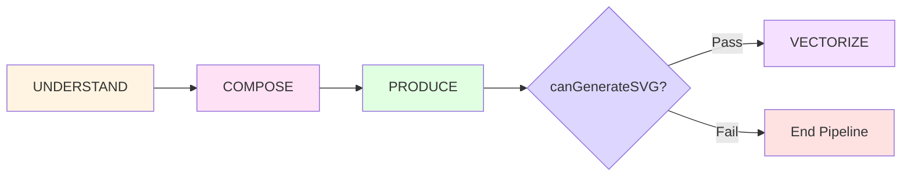
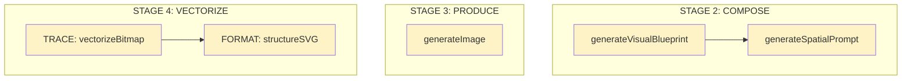
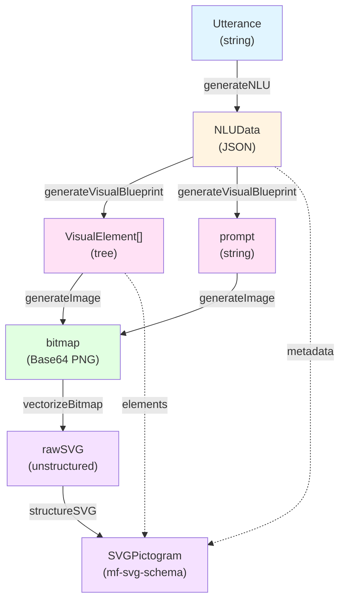

# PICTOS.NET Staged Pipeline Architecture

**Complete pipeline flow from utterance to semantic SVG pictogram**

This document provides a comprehensive technical view of the PICTOS.NET staged pipeline, detailing all processing phases, sub-components, data transformations, and dependencies.

## Pipeline Overview

PICTOS.NET implements a **3-stage semantic pipeline** where each stage has internal sub-processes that depend on upstream outputs:

1. **UNDERSTAND** - Semantic decomposition (NLU)
2. **COMPOSE** - Visual structure design
3. **PRODUCE** - Image rendering
4. **VECTORIZE** - SVG generation (optional)

## Complete Pipeline Flow Diagram

```mermaid
flowchart TD
    %% Input
    START([User Input: UTTERANCE])

    %% ========================================
    %% STAGE 1: UNDERSTAND
    %% ========================================
    subgraph STAGE1["<b>STAGE 1: UNDERSTAND</b><br/>Semantic Analysis"]
        direction TB
        S1_INPUT[/"Input: Utterance (string)"/]
        S1_PROCESS["<b>generateNLU()</b><br/>━━━━━━━━━━━━━━<br/>Model: Gemini 3 Pro<br/>System Instruction:<br/>• NSM primitive constraints<br/>• mediafranca/nlu-schema v1.0<br/>• FrameNet-compatible roles<br/>━━━━━━━━━━━━━━<br/>Processing:<br/>• Speech act classification<br/>• Intent detection<br/>• Frame-based semantic roles<br/>• NSM explications (65 primitives)<br/>• Logical form extraction<br/>• Pragmatic analysis<br/>• Visual guidelines generation"]
        S1_OUTPUT[\"Output: NLUData<br/>━━━━━━━━━━━━━━<br/>• utterance, lang<br/>• metadata (speech_act, intent)<br/>• frames[] (roles)<br/>• nsm_explications{}<br/>• logical_form<br/>• pragmatics<br/>• visual_guidelines"/]

        S1_INPUT --> S1_PROCESS
        S1_PROCESS --> S1_OUTPUT
    end

    %% ========================================
    %% STAGE 2: COMPOSE
    %% ========================================
    subgraph STAGE2["<b>STAGE 2: COMPOSE</b><br/>Visual Structure Design"]
        direction TB
        S2_INPUT[/"Input: NLUData + GlobalConfig"/]

        subgraph S2A["Sub-stage 2A: Visual Blueprint"]
            S2A_PROCESS["<b>generateVisualBlueprint()</b><br/>━━━━━━━━━━━━━━<br/>Model: Gemini 3 Pro<br/>System Instruction:<br/>• Language context (target lang)<br/>• Visual Topology Node<br/>• Element ID rules (snake_case nouns)<br/>━━━━━━━━━━━━━━<br/>Processing:<br/>• Translate semantic graph → visual graph<br/>• Generate hierarchical elements tree<br/>• Create spatial articulation logic<br/>• Root element: 'pictograma'<br/>• Focus on TOPOLOGY not style"]
            S2A_OUTPUT[\"Output:<br/>• elements: VisualElement[]<br/>• prompt: string"/]

            S2A_PROCESS --> S2A_OUTPUT
        end

        subgraph S2B["Sub-stage 2B: Spatial Articulation (optional)"]
            S2B_PROCESS["<b>generateSpatialPrompt()</b><br/>━━━━━━━━━━━━━━<br/>Model: Gemini 3 Pro<br/>System Instruction:<br/>• Spatial Articulation Node<br/>• Target language context<br/>━━━━━━━━━━━━━━<br/>Processing:<br/>• Format elements hierarchy<br/>• Generate spatial composition desc<br/>• Position relationships<br/>• Size relations<br/>• Visual metaphors"]
            S2B_OUTPUT[\"Output:<br/>• prompt: string (refined)"/]

            S2B_PROCESS --> S2B_OUTPUT
        end

        S2_INPUT --> S2A_PROCESS
        S2A_OUTPUT --> S2B_PROCESS
    end

    %% ========================================
    %% STAGE 3: PRODUCE
    %% ========================================
    subgraph STAGE3["<b>STAGE 3: PRODUCE</b><br/>Image Rendering"]
        direction TB
        S3_INPUT[/"Input:<br/>• elements: VisualElement[]<br/>• prompt: string<br/>• row: RowData<br/>• config: GlobalConfig"/]

        subgraph S3A["Sub-stage 3A: Bitmap Generation"]
            S3A_VALIDATE{"Validate<br/>elements[]<br/>is array?"}
            S3A_FORMAT["<b>Format Context</b><br/>━━━━━━━━━━━━━━<br/>• formatElements() → tree text<br/>• Extract NLU context<br/>• Build full prompt:<br/>  - Context from pipeline<br/>  - Hierarchical elements<br/>  - Spatial composition<br/>  - Graphic style (global config)<br/>  - Critical constraints"]
            S3A_SELECT{"Select Model<br/>━━━━━━━━━<br/>config.imageModel"}
            S3A_FLASH["gemini-2.5-flash-image<br/>(NanoBanana / Fast)"]
            S3A_PRO["gemini-3-pro-image-preview<br/>(NanoBanana Pro / HQ)"]
            S3A_RENDER["<b>generateContent()</b><br/>━━━━━━━━━━━━━━<br/>Config:<br/>• aspectRatio (from config)<br/>• imageConfig<br/>━━━━━━━━━━━━━━<br/>Processing:<br/>• Multimodal generation<br/>• Extract inlineData<br/>• Base64 encoding"]
            S3A_RESIZE["<b>resizeImage()</b><br/>━━━━━━━━━━━━━━<br/>• Target: 800x800px<br/>• Format: JPEG (quality 0.85)<br/>• White background fill<br/>• Canvas rendering"]
            S3A_OUTPUT[\"Output:<br/>• bitmap: string (Base64 data URL)"/]

            S3A_VALIDATE -->|Valid| S3A_FORMAT
            S3A_VALIDATE -->|Invalid| S3A_ERROR["Error:<br/>elements not array"]
            S3A_FORMAT --> S3A_SELECT
            S3A_SELECT -->|flash| S3A_FLASH
            S3A_SELECT -->|pro| S3A_PRO
            S3A_FLASH --> S3A_RENDER
            S3A_PRO --> S3A_RENDER
            S3A_RENDER --> S3A_RESIZE
            S3A_RESIZE --> S3A_OUTPUT
        end

        S3_INPUT --> S3A_VALIDATE
    end

    %% ========================================
    %% STAGE 4: VECTORIZE (Quality-Gated)
    %% ========================================
    subgraph STAGE4["<b>STAGE 4: VECTORIZE</b><br/>SVG Generation (Optional)"]
        direction TB
        S4_GATE{"<b>canGenerateSVG()</b><br/>━━━━━━━━━━━━━━<br/>• bitmap exists?<br/>• NLU complete?<br/>• elements exists?"}
        S4_FAIL[/"Gate Failed<br/>━━━━━━━━━━━━━━<br/>Reason: Missing data<br/>━━━━━━━━━━━━━━<br/>Pipeline ends here"/]

        subgraph S4A["Sub-stage 4A: TRACE"]
            S4A_INPUT[/"Input: bitmap (Base64 PNG)"/]
            S4A_DECODE["<b>base64ToImageData()</b><br/>━━━━━━━━━━━━━━<br/>• Image() element<br/>• Canvas rendering<br/>• OffscreenCanvas fallback<br/>• Extract ImageData"]
            S4A_CONFIG["<b>VectorizerConfig</b><br/>━━━━━━━━━━━━━━<br/>Defaults (optimized for pictograms):<br/>• mode: 'spline'<br/>• filterSpeckle: 8<br/>• cornerThreshold: 70<br/>• lengthThreshold: 6.0<br/>• maxIterations: 15<br/>• spliceThreshold: 50<br/>• pathPrecision: 2"]
            S4A_CONVERT["<b>BinaryImageConverter</b><br/>━━━━━━━━━━━━━━<br/>WASM Engine: VTracer<br/>━━━━━━━━━━━━━━<br/>Processing:<br/>• init()<br/>• tick() loop with progress<br/>• Spline curve fitting<br/>• Path optimization<br/>• Noise removal"]
            S4A_FALLBACK{"Mode<br/>= spline<br/>&&<br/>failed?"}
            S4A_RETRY["<b>Retry with Polygon Mode</b><br/>━━━━━━━━━━━━━━<br/>• mode: 'polygon'<br/>• Sharper corners<br/>• More stable"]
            S4A_OUTPUT[\"Output:<br/>• rawSVG: string<br/>  (unstructured paths)"/]

            S4A_INPUT --> S4A_DECODE
            S4A_DECODE --> S4A_CONFIG
            S4A_CONFIG --> S4A_CONVERT
            S4A_CONVERT -->|Success| S4A_OUTPUT
            S4A_CONVERT -->|Error| S4A_FALLBACK
            S4A_FALLBACK -->|Yes| S4A_RETRY
            S4A_FALLBACK -->|No| S4A_ERROR["Vectorization Failed"]
            S4A_RETRY --> S4A_OUTPUT
        end

        subgraph S4B["Sub-stage 4B: FORMAT"]
            S4B_INPUT[/"Input:<br/>• rawSVG: string<br/>• bitmap: string (visual ref)<br/>• nlu: NLUData<br/>• elements: VisualElement[]<br/>• utterance: string<br/>• config: GlobalConfig"/]

            S4B_META["<b>buildMetadataJSON()</b><br/>━━━━━━━━━━━━━━<br/>• extractNSMPrimes(nlu)<br/>• buildConceptsArray(elements, nlu)<br/>━━━━━━━━━━━━━━<br/>Output JSON:<br/>  - version<br/>  - utterance<br/>  - nsm {primes, gloss}<br/>  - concepts[] {id, role, label, nsmPrime}<br/>  - accessibility {cognitiveDesc, visualDesc}<br/>  - provenance {generator, date, license}"]

            S4B_CSS["<b>generateStylesheet(config)</b><br/>━━━━━━━━━━━━━━<br/>• Extract config.svgStyles<br/>• Generate CSS classes (.f, .k)<br/>• Add utility classes<br/>• Focus states for a11y<br/>• Animations (pulse, spin)"]

            S4B_INST["<b>buildSystemInstruction()</b><br/>━━━━━━━━━━━━━━<br/>Model: Gemini 3 Pro<br/>Instructions:<br/>• SVG restructuring agent<br/>• mf-svg-schema spec<br/>• Visual correlation rules<br/>• Grouping strategy<br/>• Embed metadata JSON<br/>• Embed CSS stylesheet<br/>• Output complete SVG"]

            S4B_FORMAT["<b>formatElements()</b><br/>━━━━━━━━━━━━━━<br/>Recursive tree → text<br/>with indentation"]

            S4B_MULTIMODAL["<b>generateContentStream()</b><br/>━━━━━━━━━━━━━━<br/>Multimodal Request:<br/>━━━━━━━━━━━━━━<br/>Part 1: inlineData<br/>  • mimeType: image/png<br/>  • data: base64<br/>Part 2: text<br/>  • Image reference<br/>  • Hierarchical elements<br/>  • Raw SVG geometry<br/>  • Grouping instructions<br/>━━━━━━━━━━━━━━<br/>Streaming Response:<br/>• Chunk-by-chunk<br/>• Progress tracking<br/>• Accumulate text"]

            S4B_CLEAN["<b>cleanSVGResponse()</b><br/>━━━━━━━━━━━━━━<br/>• Remove markdown blocks<br/>• Extract &lt;svg&gt;...&lt;/svg&gt;<br/>• Trim whitespace"]

            S4B_SANITIZE["<b>sanitizeSVG()</b><br/>━━━━━━━━━━━━━━<br/>• Remove inline fill/stroke<br/>• Remove inline style attrs<br/>• Force CSS class usage<br/>• 3-pass regex cleanup"]

            S4B_VALIDATE{"Valid<br/>SVG?"}

            S4B_OUTPUT[\"Output:<br/>• svg: string<br/>  (mf-svg-schema compliant)<br/>━━━━━━━━━━━━━━<br/>Structure:<br/>  • &lt;svg&gt; root (with a11y attrs)<br/>  • &lt;title&gt; + &lt;desc&gt;<br/>  • &lt;metadata&gt; (JSON block)<br/>  • &lt;defs&gt;&lt;style&gt; (CSS)<br/>  • Semantic &lt;g&gt; groups<br/>    - Grouped by concept<br/>    - data-concept, role, aria-label<br/>    - class assignments (f/k)<br/>  • All paths preserved"/]

            S4B_INPUT --> S4B_META
            S4B_INPUT --> S4B_CSS
            S4B_META --> S4B_INST
            S4B_CSS --> S4B_INST
            S4B_INPUT --> S4B_FORMAT
            S4B_FORMAT --> S4B_MULTIMODAL
            S4B_INST --> S4B_MULTIMODAL
            S4B_MULTIMODAL --> S4B_CLEAN
            S4B_CLEAN --> S4B_SANITIZE
            S4B_SANITIZE --> S4B_VALIDATE
            S4B_VALIDATE -->|Yes| S4B_OUTPUT
            S4B_VALIDATE -->|No| S4B_ERROR["Invalid SVG"]
        end

        S4_GATE -->|Pass| S4A_INPUT
        S4_GATE -->|Fail| S4_FAIL
        S4A_OUTPUT --> S4B_INPUT
    end

    %% ========================================
    %% FINAL OUTPUT & STORAGE
    %% ========================================
    subgraph STORAGE["<b>STORAGE</b><br/>Dual Storage Architecture"]
        direction TB
        STORE_ROW["<b>RowData Storage</b><br/>━━━━━━━━━━━━━━<br/>localStorage: pictos_v19_storage<br/>━━━━━━━━━━━━━━<br/>Contains:<br/>• id, UTTERANCE<br/>• NLU (complete)<br/>• elements[], prompt<br/>• bitmap (Base64 PNG)<br/>• status, durations"]
        STORE_SVG["<b>SVG Library Storage</b><br/>━━━━━━━━━━━━━━<br/>localStorage: pictos_svg_library<br/>━━━━━━━━━━━━━━<br/>Contains:<br/>• SVGPictogram[]<br/>  - id, utterance<br/>  - svg (structured)<br/>  - sourceRowId<br/>  - createdAt, lang<br/>━━━━━━━━━━━━━━<br/>SSoT Pattern:<br/>Self-contained artifacts"]
    end

    END([Complete Pictogram])

    %% ========================================
    %% MAIN FLOW CONNECTIONS
    %% ========================================
    START --> S1_INPUT
    S1_OUTPUT -->|NLUData| S2_INPUT
    S2B_OUTPUT -->|elements + prompt| S3_INPUT
    S3A_OUTPUT -->|bitmap| STORE_ROW
    S3A_OUTPUT --> S4_GATE
    S4B_OUTPUT --> STORE_SVG
    STORE_ROW --> END
    STORE_SVG --> END

    %% ========================================
    %% STYLING
    %% ========================================
    classDef stage1 fill:#fff4e1,stroke:#f59e0b,stroke-width:3px,color:#000
    classDef stage2 fill:#ffe1f5,stroke:#ec4899,stroke-width:3px,color:#000
    classDef stage3 fill:#e1ffe1,stroke:#22c55e,stroke-width:3px,color:#000
    classDef stage4 fill:#f5e1ff,stroke:#a855f7,stroke-width:3px,color:#000
    classDef storage fill:#e1f5ff,stroke:#3b82f6,stroke-width:3px,color:#000
    classDef process fill:#fef3c7,stroke:#fbbf24,stroke-width:2px,color:#000
    classDef output fill:#d1fae5,stroke:#10b981,stroke-width:2px,color:#000
    classDef error fill:#fee2e2,stroke:#ef4444,stroke-width:2px,color:#000
    classDef decision fill:#ddd6fe,stroke:#8b5cf6,stroke-width:2px,color:#000

    class STAGE1 stage1
    class STAGE2 stage2
    class STAGE3 stage3
    class STAGE4 stage4
    class STORAGE storage
    class S1_PROCESS,S2A_PROCESS,S2B_PROCESS,S3A_FORMAT,S3A_RENDER,S4A_CONVERT,S4B_MULTIMODAL process
    class S1_OUTPUT,S2A_OUTPUT,S2B_OUTPUT,S3A_OUTPUT,S4A_OUTPUT,S4B_OUTPUT output
    class S3A_ERROR,S4A_ERROR,S4B_ERROR,S4_FAIL error
    class S3A_VALIDATE,S3A_SELECT,S4_GATE,S4A_FALLBACK,S4B_VALIDATE decision
```



## Stage Dependencies

### Sequential Dependencies

Each stage depends on the complete output of the previous stage:



### Internal Sub-Dependencies



## Data Flow Diagram

Complete data transformation through the pipeline:



## Processing Time Distribution

Typical timing for each stage (Gemini 3 Pro + Flash):

| Stage | Sub-Process | Typical Duration | Bottleneck |
|-------|-------------|------------------|------------|
| **UNDERSTAND** | generateNLU | 3-8s | API latency |
| **COMPOSE** | generateVisualBlueprint | 4-10s | API latency |
| **COMPOSE** | generateSpatialPrompt (opt) | 3-6s | API latency |
| **PRODUCE** | generateImage | 8-15s (flash) / 20-40s (pro) | Image synthesis |
| **PRODUCE** | resizeImage | <1s | Canvas rendering |
| **VECTORIZE** | vectorizeBitmap | 2-10s | WASM computation |
| **VECTORIZE** | structureSVG | 15-30s | Multimodal API + streaming |

**Total Pipeline (no SVG)**: ~20-40 seconds (automated)
**Total Pipeline (with SVG)**: ~40-80 seconds (automated)

## Model Usage Summary

| Model | Usage Count | Stages |
|-------|-------------|--------|
| **Gemini 3 Pro** | 4x | NLU, Visual Blueprint, Spatial Prompt (opt), SVG Format |
| **Gemini 2.5 Flash Image** | 1x | Bitmap Generation (fast mode) |
| **Gemini 3 Pro Image** | 1x | Bitmap Generation (HQ mode) |
| **VTracer WASM** | 1x | Bitmap → SVG vectorization |

**Total API Calls per Pictogram**: 4-5 calls (3-4 text + 1 image + 1 multimodal SVG)

## Quality Gates

### Gate 1: NLU Validation
- **Location**: Between UNDERSTAND → COMPOSE
- **Criteria**: Valid JSON schema, required fields present
- **Action if failed**: Error state, manual edit required

### Gate 2: Elements Validation
- **Location**: Between COMPOSE → PRODUCE
- **Criteria**: `elements` is array, non-empty
- **Action if failed**: Error state, regenerate visual

### Gate 3: SVG Eligibility Check
- **Location**: Before VECTORIZE
- **Criteria**:
  - Bitmap exists
  - NLU complete
  - Elements exist
- **Action if failed**: Skip SVG generation, end pipeline

## Storage Architecture

### RowData (Primary Pipeline)

**Location**: `localStorage['pictos_v19_storage']`

**Purpose**: Complete generative pipeline traceability

**Contents**:
```typescript
{
  id: string;
  UTTERANCE: string;
  NLU: NLUData;
  elements: VisualElement[];
  prompt: string;
  bitmap: string; // Base64 PNG
  // Status tracking
  nluStatus, visualStatus, bitmapStatus;
  // Performance metrics
  nluDuration, visualDuration, bitmapDuration;
}
```

### SVG Library (Quality-Gated Artifacts)

**Location**: `localStorage['pictos_svg_library']`

**Purpose**: Production-ready semantic pictograms (SSoT)

**Contents**:
```typescript
{
  id: string;
  utterance: string;
  svg: string; // mf-svg-schema compliant
  sourceRowId: string; // Reference to RowData
  createdAt: string;
  lang: string;
}
```

**Relationship**: 1:1 with RowData via `sourceRowId`

## Error Handling & Fallbacks

### UNDERSTAND Stage
- **Error**: Invalid JSON response
- **Fallback**: `cleanJSONResponse()` cleanup, retry parsing
- **User action**: Manual edit NLU JSON

### COMPOSE Stage
- **Error**: Elements not array
- **Fallback**: Return empty array `[]`
- **User action**: Regenerate visual blueprint

### PRODUCE Stage
- **Error**: No image generated
- **Fallback**: Throw error, mark status as 'error'
- **User action**: Retry with different model or config

### VECTORIZE - TRACE
- **Error**: Spline mode fails
- **Fallback**: Automatic retry with polygon mode
- **User action**: Manual config adjustment if both fail

### VECTORIZE - FORMAT
- **Error**: Invalid SVG response
- **Fallback**: None, return error result
- **User action**: Retry structuring or accept raw SVG

## Optimization Opportunities

### Current Bottlenecks
1. **Sequential API calls**: Each stage waits for previous completion
2. **Large bitmaps**: 800x800 JPEG still ~50-150KB in localStorage
3. **Multimodal SVG structuring**: Longest single operation (~15-30s)
4. **No batching**: One utterance at a time

### Future Optimizations
1. **Parallel processing**: Process multiple utterances concurrently
2. **IndexedDB migration**: Move bitmaps out of localStorage
3. **Streaming UI updates**: Show partial results during generation
4. **Caching**: Cache NLU results for repeated utterances
5. **Worker threads**: Offload WASM vectorization to Web Worker
6. **Progressive enhancement**: Generate low-res preview, then HQ

## API Cost Analysis

Based on Gemini API pricing (approximate):

| Operation | Input Tokens | Output Tokens | Est. Cost |
|-----------|--------------|---------------|-----------|
| NLU | ~500 | ~800 | $0.002 |
| Visual Blueprint | ~1000 | ~400 | $0.001 |
| Spatial Prompt (opt) | ~800 | ~200 | $0.001 |
| Bitmap (Flash) | ~1500 | Image | $0.003 |
| Bitmap (Pro) | ~1500 | Image | $0.008 |
| SVG Format | ~3000 + Image | ~8000 | $0.015 |

**Total per Pictogram**:
- Without SVG: ~$0.006-0.011
- With SVG: ~$0.021-0.026

*Note: Costs are estimates and vary based on actual token usage*

## Schema Compliance

### External Schemas (Git Submodules)
- **nlu-schema** (mediafranca/nlu-schema) - Used in UNDERSTAND stage
- **mf-svg-schema** (mediafranca/mf-svg-schema) - Used in VECTORIZE stage (format)

### Schema Versions
- NLU Schema: v1.0
- MF-SVG Schema: v1.0.0

## Related Documentation

- **[ARCHITECTURE.md](ARCHITECTURE.md)** - Overall system architecture
- **[TUTORIAL.md](TUTORIAL.md)** - User guide (Spanish)
- **[CONTRIBUTING.md](CONTRIBUTING.md)** - Development guide
- **[SECURITY.md](SECURITY.md)** - Security policies

## Version History

- **v1.0.0** (2026-01-27) - Initial SVG generation pipeline
- **v1.0.1** (2026-02-12) - Pipeline documentation
- **v1.0.2** (2026-02-18) - ICAP evaluation extracted to independent module

## Summary

The PICTOS.NET pipeline implements a **semantics-first approach** to pictogram generation:

1. **Deep understanding** before visualization (NSM primitives)
2. **Structured composition** separating topology from style
3. **Semantic vectorization** for interoperable, accessible pictograms

Each stage builds upon the complete output of the previous stage, ensuring **semantic consistency** and **traceability** throughout the entire generative process.

The dual storage architecture separates **iterative design** (RowData with bitmaps) from **production artifacts** (SVG Library), enabling both rapid prototyping and high-quality output.
