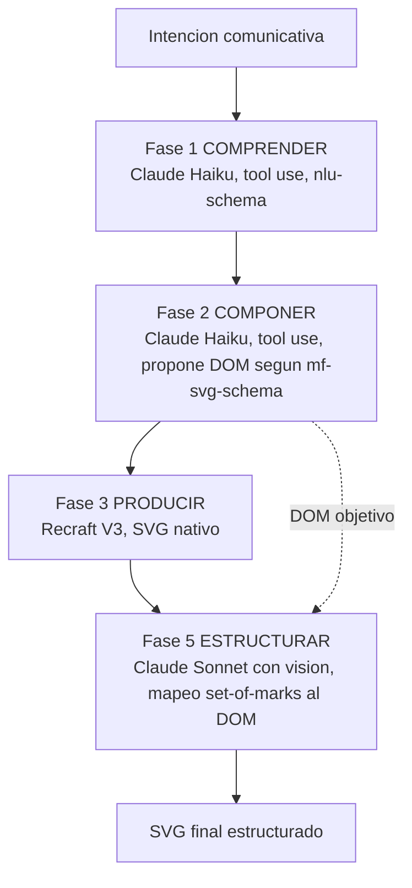

# Especificacion: Migracion del pipeline a Claude + Recraft

Estado: borrador para revision (rama `dev`). Respaldo del estado anterior con Gemini en la rama `dev-gemini`.

## Decisiones cerradas

Estas decisiones provienen de la elicitacion inicial y enmarcan toda la especificacion.

1. No hay seleccion de proveedor. El pipeline tiene un unico camino: Claude para las fases 1-2 y 5, Recraft para la fase 3.
2. Gemini se retira por completo de esta rama. Ningun servicio del pipeline lo invoca.
3. La fase 4 (Vectorizar / trace con VTracer) se elimina, junto con `vtracerService`, porque Recraft entrega SVG nativo y en esta rama no hay flujo de vectorizacion de imagenes subidas por el usuario.
4. La fase 5 (Estructurar) se conserva y se redefine: toma el DOM propuesto en la fase 2 y modela el SVG de Recraft segun ese DOM, siguiendo la logica de `mf-svg-schema`, con asignacion guiada por vision.
5. El JSON entre fases se mantiene como estructura de datos coherente, y su conformidad se garantiza con tool use de la API de Anthropic.
6. Se acepta una migracion de datos, pero las librerias antiguas deben seguir abriendose (lectura compatible hacia atras).
7. Funciones Netlify separadas por proveedor. Primero se prueba en local con `netlify dev`; el deployment se define despues.

## 1. Contexto y objetivo

En junio de 2026, el proyecto de Google Cloud que respaldaba la fase de produccion (`gen-lang-client-0167983259`) fue suspendido con motivo `CONSUMER_SUSPENDED`. La causa raiz fue el abuso de una clave de Gemini sin restricciones: la aplicacion exponia un proxy server-side protegido solo por autenticacion, mientras el registro de usuarios estaba abierto, lo que permitio que una cuenta no autorizada consumiera cuota de forma anomala.[^1]

Mas alla de la correccion inmediata de ese incidente, el episodio dejo en evidencia el riesgo de acoplar todo el pipeline a un unico proveedor cuya cuenta puede suspenderse de forma automatica. El objetivo de esta migracion es doble: desacoplar el sistema de Google y, de paso, simplificar el pipeline aprovechando que el nuevo proveedor de produccion entrega SVG nativo.

El pipeline migra a un stack independiente: Claude (Anthropic) para comprender y componer, Recraft para producir el SVG, y Claude con vision para estructurar el resultado segun el DOM propuesto. El beneficio es independencia de proveedor, un pipeline mas corto al eliminar el paso de vectorizacion, y una fase de estructuracion mas robusta porque pasa a apoyarse en comprension visual y no solo en heuristicas geometricas.

## 2. Alcance

Dentro de alcance: portar las fases 1 (Comprender) y 2 (Componer) a Claude Haiku; portar la fase 3 (Producir) a Recraft V3 en modo SVG; eliminar la fase 4 (Vectorizar) y el servicio `vtracerService`; redefinir la fase 5 (Estructurar) con asignacion guiada por vision; crear los servicios y funciones Netlify correspondientes; mantener la lectura compatible de librerias antiguas; y dejar el sistema probado de extremo a extremo en local.

Fuera de alcance en esta especificacion: el deployment productivo y la configuracion de variables de entorno en Netlify, que se definen en una fase posterior; cualquier mecanismo de conmutacion de proveedor; la permanencia de Gemini; y cambios de interfaz ajenos al pipeline.

## 3. Arquitectura objetivo

El pipeline pasa de cinco fases (tres automaticas mas dos opcionales) a cuatro fases efectivas, todas servidas por Claude o Recraft.

Cambios en el mapa de servicios. Se retiran `services/geminiService.ts` y `services/vtracerService.ts`. Se incorporan `services/claudeService.ts` (fases 1, 2 y 5) y `services/recraftService.ts` (fase 3). Se redefine `services/svgStructureService.ts` para implementar el mapeo guiado por vision en lugar de la asignacion previa. Se refactoriza `services/aiClient.ts` para hablar siempre con funciones Netlify, eliminando el modo de desarrollo que embebia la clave en el cliente. `App.tsx` mantiene la orquestacion (`processCascade`, `processStep`), ajustando la secuencia de fases.

## 4. Requerimientos funcionales por fase

### 4.1 Fase 1 COMPRENDER (Claude Haiku)

Entrada: la intencion comunicativa en texto del usuario. Modelo: `claude-haiku-4-5`. Mecanismo: una llamada con tool use, donde se define una herramienta cuyo `input_schema` es el `nlu-schema`; al forzar el uso de esa herramienta, el modelo debe responder con un JSON conforme al esquema.[^2] Salida: la estructura NLU en JSON, con el mismo contrato que produce hoy el pipeline, de modo que las fases siguientes no perciban el cambio de proveedor.

### 4.2 Fase 2 COMPONER (Claude Haiku, produce el DOM)

Entrada: la estructura NLU de la fase 1. Modelo: `claude-haiku-4-5` con tool use. Salida: el DOM objetivo del pictograma, es decir la estructura semantica de nodos (partes y grupos, con sus ids y significado) conforme a `mf-svg-schema`. Este DOM es el contrato central de la migracion: no solo describe que debe contener el pictograma, sino que define el conjunto de nodos validos que la fase 5 usara para estructurar el SVG. Por eso su conformidad con `mf-svg-schema` se valida estrictamente antes de continuar.

### 4.3 Fase 3 PRODUCIR (Recraft V3 SVG)

Entrada: un prompt visual derivado de las fases 1 y 2. Servicio: Recraft V3, endpoint de texto-a-imagen en modo SVG (`recraft-v3-svg`), con estilo de pictograma plano. Salida: un SVG nativo, con paths y anchor points reales, no un raster envuelto en `<svg>`. No hay rasterizado intermedio ni vectorizacion posterior: la salida de esta fase entra directamente a la fase 5.

### 4.4 Fase 5 ESTRUCTURAR (mapeo guiado por vision)

La fase 5 toma el SVG plano de Recraft y lo reorganiza en la estructura semantica del DOM de la fase 2. El requisito es no aceptar asignaciones equivocadas, es decir, ningun elemento semantico intercambiado. Para lograrlo se usa un mapeo guiado por vision con marcas numeradas (set-of-marks), en cinco pasos.

Primero, una preparacion local determinista parsea el SVG en sus paths y shapes, asigna a cada uno un indice estable y calcula su bounding box y centroide. Segundo, se rasteriza el SVG a imagen y se sobreimprime en el centroide de cada elemento una etiqueta numerada visible; estas marcas anclan la comprension visual a indices concretos, de modo que el modelo no refiera elementos de forma ambigua sino por su indice. Tercero, se envia a un Claude con vision la imagen marcada, el DOM objetivo de la fase 2 y la instruccion de devolver, via tool use, un JSON que mapee cada indice a exactamente un nodo del DOM o a "ninguno". El `input_schema` de la herramienta define el conjunto de nodos validos como un enum, por lo que el modelo no puede asignar a un nodo inexistente ni inventar uno: el espacio de salida queda restringido al DOM real. Cuarto, se solicita ademas una confianza por asignacion y una justificacion breve, y el codigo valida que el mapeo sea total y consistente, es decir que todo nodo semantico requerido quede cubierto y sin conflictos; si alguna asignacion queda con baja confianza o un nodo obligatorio sin mapear, se dispara una segunda pasada con el elemento renderizado en aislamiento, o se eleva al usuario. Quinto, con el mapeo ya validado, codigo local agrupa los elementos en la estructura del DOM siguiendo `mf-svg-schema`; el modelo solo decide el mapeo y el codigo construye el SVG final.

Modelo: `claude-sonnet` para esta fase, dada la tolerancia cero a errores semanticos y que corre una sola vez por pictograma. Haiku 4.5 tambien dispone de vision y queda como opcion de optimizacion de costo si la precision se mantiene aceptable. Un caso que el diseno cubre explicitamente: cuando un elemento semantico esta compuesto por varios paths, varias marcas apuntan al mismo nodo, y la validacion de cobertura lo verifica.

## 5. Contrato de datos y schemas

El flujo entre fases se mantiene como JSON estructurado, y su conformidad se garantiza con tool use en cada llamada a Claude. La fase 1 produce JSON conforme a `nlu-schema`; las fases 2 y 5 operan sobre `mf-svg-schema`, la primera generando el DOM y la segunda mapeando hacia el. La diferencia tecnica respecto del pipeline anterior es que Gemini usaba `responseMimeType: 'application/json'` con `responseSchema`, mientras que en Anthropic la conformidad se obtiene definiendo una herramienta con `name`, `description` e `input_schema`, y forzando su uso con `tool_choice`. El resultado es equivalente en garantia de forma, pero el manejo de errores debe contemplar el caso en que el modelo no invoque la herramienta, reintentando o degradando con un mensaje claro.

Para soportar compatibilidad, el formato de salida y de libreria incorpora un campo de version de pipeline o de esquema, que permite distinguir contenido nuevo de contenido legado al momento de leerlo.

## 6. Compatibilidad y migracion

Las librerias antiguas deben seguir abriendose. La estrategia es una migracion perezosa con un adaptador de lectura: al abrir una libreria, se detecta su version; si carece del campo de version se trata como formato legado y una capa de adaptacion lo normaliza al modelo interno actual en memoria, sin reescribir el original. La escritura siempre usa el nuevo formato versionado. Se preservan los metadatos y los binarios almacenados en IndexedDB (bitmaps y SVG previos); lo que cambia es la procedencia del proveedor y la ausencia del paso de vectorizacion. De este modo el usuario puede abrir y visualizar librerias creadas con el pipeline de Gemini, aunque las nuevas generaciones sigan el camino Claude mas Recraft.

## 7. Capa de servicios e infraestructura

El refactor central es en `aiClient`. Hoy opera en modo dual: en desarrollo llama directo al SDK con la clave inyectada por Vite en el cliente, y en produccion proxea a una funcion Netlify. Ese modo de desarrollo es justamente el patron que dejo una clave expuesta como riesgo latente. La propuesta es eliminarlo y hablar siempre con funciones, usando `netlify dev` en local para correr las funciones con las claves del lado del servidor. Asi local y produccion comparten el mismo camino seguro, y ninguna clave llega nunca al navegador.

Sobre esa base, `claudeService` atiende las fases 1, 2 y 5, y `recraftService` la fase 3; ambos llaman a sus respectivas funciones. Se crean funciones Netlify separadas: `api-claude` y `api-recraft`. Cada una valida el JWT de identidad, lee su propia clave de entorno (`ANTHROPIC_KEY` y `RECRAFT_API_KEY` respectivamente), restringe por whitelist los modelos u operaciones permitidas, aplica CORS a los origenes validos y no registra secretos en sus logs. Esto reemplaza la lectura previa de `process.env.API_KEY` por una variable por funcion.

Las lecciones de seguridad del incidente quedan incorporadas como requisitos de infraestructura: las claves nunca viven en el cliente; las claves se crean con restricciones en cada proveedor; el registro de usuarios pasa a invitacion; se aplica rate limiting por usuario en las funciones; y se configura un presupuesto con alertas. Las cuatro ultimas se materializan en la fase de deployment, pero se documentan aqui para que el diseno las contemple desde el inicio.

## 8. Requerimientos no funcionales

Costo por pictograma, como orden de magnitud: las fases 1 y 2 con Haiku son fracciones de centavo por ser solo texto; la fase 3 con Recraft en modo SVG cuesta del orden de 0.08 dolares por vector; la fase 5 con Sonnet y vision agrega unos pocos centavos por la imagen marcada mas el razonamiento. El total estimado por pictograma queda en el rango de centavos, dominado por Recraft.[^3]

Latencia: el camino critico es Recraft mas la pasada de vision; se define un objetivo de tiempo de extremo a extremo durante el prototipado. Seguridad: segun la seccion 7. Observabilidad: logs sin secretos que registren proveedor, modelo, usuario y costo aproximado por llamada. Fiabilidad: la validacion de la fase 5 con reintento ante baja confianza es parte del requisito de correccion, no un extra.

## 9. Plan de implementacion

El orden prioriza dejar todo funcionando en local antes de pensar en deployment.

1. Base ya establecida: rama `dev` de trabajo y `dev-gemini` como respaldo del estado con Gemini.
2. `claudeService` y funcion `api-claude`; portar la fase 1 con tool use y validar contra `nlu-schema`.
3. Portar la fase 2, produciendo el DOM conforme a `mf-svg-schema`.
4. `recraftService` y funcion `api-recraft`; implementar la fase 3 con salida SVG.
5. Implementar la fase 5 con el mapeo set-of-marks y el ensamblado local.
6. Retirar `geminiService`, `vtracerService` y la fase 4 del cascade; limpiar `aiClient`.
7. Capa de compatibilidad de lectura de librerias antiguas.
8. Pruebas locales de extremo a extremo con `netlify dev`.
9. Diferido: deployment, variables de entorno en Netlify, restriccion de claves, registro por invitacion, rate limiting y presupuesto con alertas.

## 10. Riesgos y decisiones abiertas

La calidad pictografica de Recraft frente a Gemini debe validarse con un prototipo temprano antes de comprometer el resto del trabajo. La consistencia del SVG de Recraft es un riesgo: si fragmenta en exceso los paths, complica el mapeo de la fase 5, lo que refuerza la necesidad de la validacion de cobertura. La precision del mapeo guiado por vision debe medirse con casos reales, definiendo el umbral de confianza que dispara la segunda pasada. El costo de Sonnet podria importar si el volumen crece, con Haiku 4.5 con vision como alternativa. Debe confirmarse que ni Anthropic ni Recraft se invocan desde el navegador, sino siempre via funcion, tanto por CORS como por seguridad. Queda por fijar la resolucion del render marcado que la vision necesita para distinguir elementos pequenos sin exceder limites de tamano de imagen. Y el manejo de tool use debe contemplar el caso en que el modelo no llame la herramienta.

[^1]: El detalle del incidente y su mitigacion se trataron por separado; aqui solo interesa como motivacion del desacople de proveedor.

[^2]: En la API de Anthropic, forzar tool use se logra con `tool_choice` apuntando a la herramienta definida, cuyo `input_schema` es el JSON Schema de salida deseado.

[^3]: Cifras de referencia a junio de 2026; deben reconfirmarse contra la facturacion real durante el prototipo.
